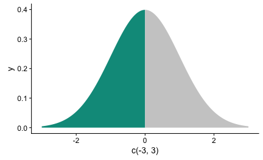
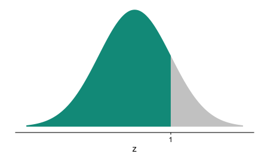
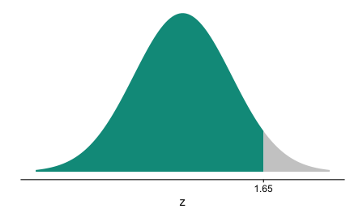
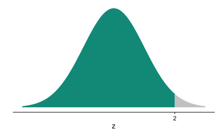

Shading values/areas under the normal curve is a quite frequent taks in eg educational contexts. Thanks to Hadley in [this post](
https://github.com/tidyverse/ggplot2/issues/1528), I found this easy solution.


```r
library(ggplot2)


ggplot(NULL, aes(c(-3,3))) + 
  geom_area(stat = "function", fun = dnorm, fill = "#00998a", xlim = c(-3, 0)) +
  geom_area(stat = "function", fun = dnorm, fill = "grey80", xlim = c(0, 3))
```



Simple, right?


Some minor beautification:


```r
library(cowplot)

 ggplot(NULL, aes(c(-3,3))) + 
  geom_area(stat = "function", fun = dnorm, fill = "#00998a", xlim = c(-3, 1)) +
  geom_area(stat = "function", fun = dnorm, fill = "grey80", xlim = c(1, 3)) +
  labs(x = "z", y = "") +
  scale_y_continuous(breaks = NULL) +
  scale_x_continuous(breaks = 1)
```




And some other quantiles:


```r
ggplot(NULL, aes(c(-3,3))) + 
  geom_area(stat = "function", fun = dnorm, fill = "#00998a", xlim = c(-3, 1.65)) +
  geom_area(stat = "function", fun = dnorm, fill = "grey80", xlim = c(1.65, 3)) +
  labs(x = "z", y = "") +
  scale_y_continuous(breaks = NULL) +
  scale_x_continuous(breaks = 1.65)
```



```r
ggplot(NULL, aes(c(-3,3))) + 
  geom_area(stat = "function", fun = dnorm, fill = "#00998a", xlim = c(-3, 2)) +
  geom_area(stat = "function", fun = dnorm, fill = "grey80", xlim = c(2, 3)) +
  labs(x = "z", y = "") +
  scale_y_continuous(breaks = NULL) +
  scale_x_continuous(breaks = 2)
```



